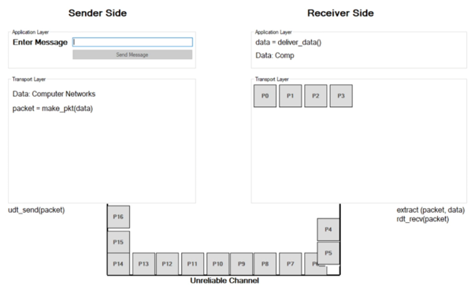
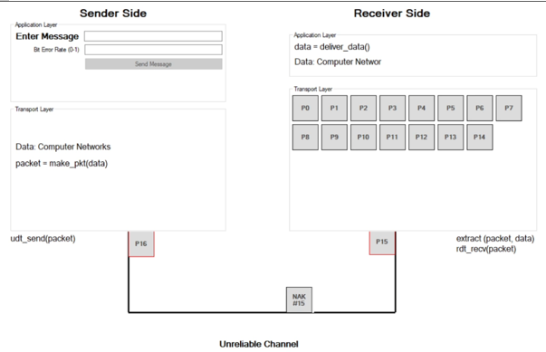
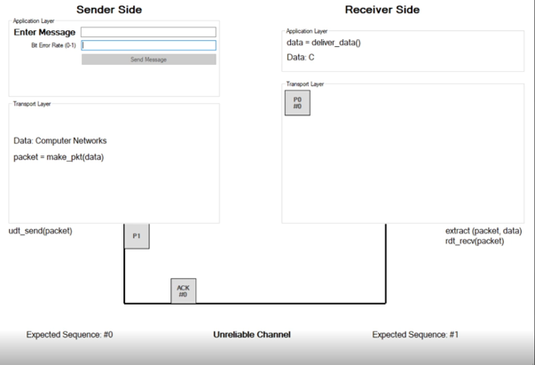
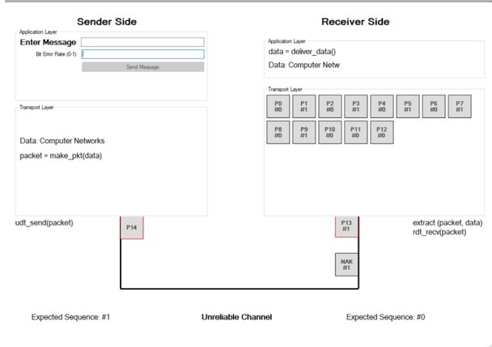
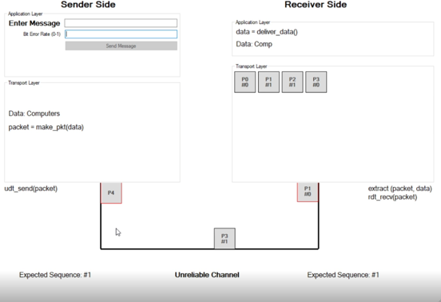
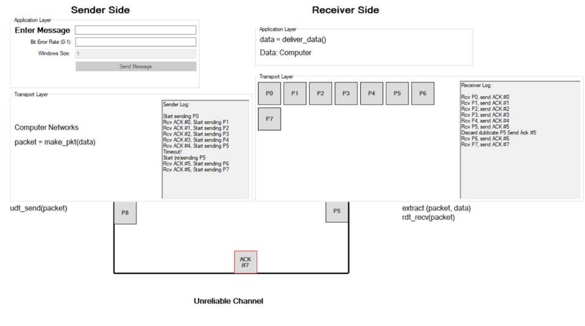

# RDT Protocols Simulation
This project simulates the Reliable Data Transfer protocols 1.0, 2.0, 2.1, 2.2, 3.0 and one pipeline protocol that is Go Back N. 

In the RDT Protocol simulations, we assume that the packet length is 1byte, so every character in the message is a packet.

## RDT 1.0
In Reliable Data Transfer 1.0, there is no packet loss, no bit errors. We assume that the RDT 1.0 channel completely faultless. All packets transfers from sender to receiver in order without waiting anything from receiver.

## RDT 2.0
Now we can consider on bit errors with Reliable Data Transfer 2.0. RDT 2.0 can handle bit errors but cannot handle packet loss. Furthermore RDT 2.0 has a fatal flaw. Data Packets which has bit errors can be rescued, but the protocol cannot rescue corrupted ACKs or NAKs.

## RDT 2.1
Now we can handle corrupted ACK or NAKs. With RDT 2.1 Sender must check whether received ACK/NAK is corrupted or not. If the Sender determines the received response is corrupted, just sends the last packet again. Therefore, receiver must check whether the received packet is dublicate or not. If it is dublicate, just dismiss the packet and send ACK/NAK of this packet.
Also there is an innovation with RDT 2.1. There is no more increasing sequence numbers up to number of packets. Just use 0 or 1 for sequence numbers. Sender and Receiver knows the expected sequence number for itself. 

## RDT 2.2
In RDT 2.2, there are more NAKs. Instead of NAK, just resend the last ACK to the sender. So Sender must check whether the incoming ACK is dublicate or not. If it is dublicate, just send the last packet to receiver side.

## RDT 3.0
In RDT 3.0, we assume that there may be packet loss in the unreliable data channel. Now, we have timeout mechanism for packet losses. Sender sets a timer for last packet send. When there is a packet loss, the packet cannot reach to the receiver side and sender cannot get response from receiver. When timeout occurs, sender detects the packet loss, and sends the last packet again.

